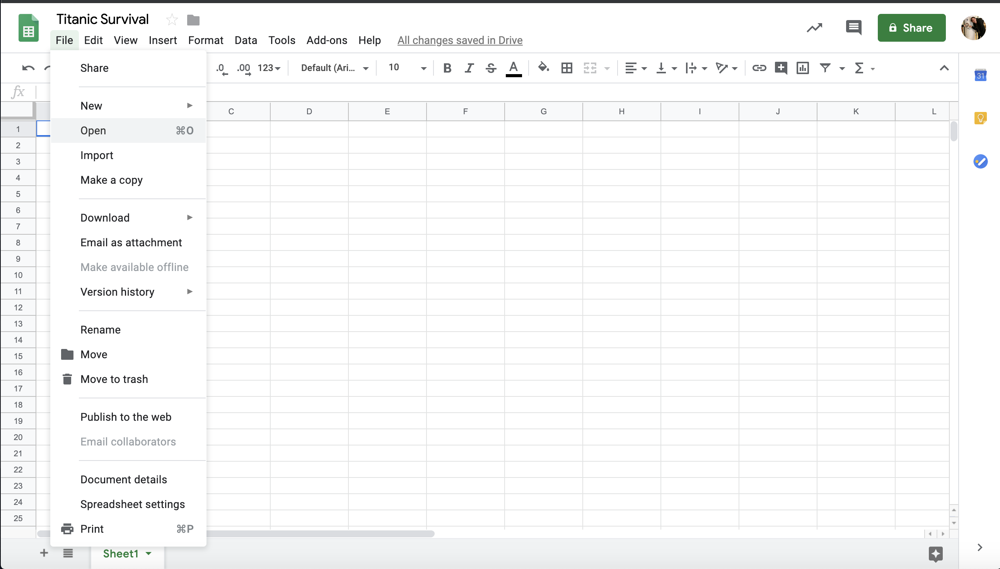

# Data Wrangling Tutorial

Using the Titanic Survival dataset as an example, this tutorial will go through the process for finding and preparing your own dataset to use in a neural network in ml5.

## 1. Looking for a Dataset

There are many places to find datasets on the internet. For example, most large cities now have Open Data Portals and many federal agencies publish data online. Depending on where you are looking, the dataset may have been created for different uses and not be structured for your ML needs. One especially good place for machine learning datasets is Kaggle, which is a site that hosts data science competitions.

To find the dataset that is right for your project, it’s helpful to ask some critical questions as you do your research into different datasets and sources. Important questions to ask yourself include:
* Who collected and compiled the dataset?
* Why was the data collected and compiled (to comply with regulations, for fun, for research purposes, etc.)?
* What methods were used to collect the data (in-person survey, sensors, etc.)?
* How many rows and columns does the dataset have? If you have to download it, what is the file size?
* Is there a data dictionary associated with the dataset (a key that tells you about what is included in the dataset)?
* Are there missing, incomplete, or invalid elements of the dataset? What other problems do you notice?
* What format is the dataset in (for example csv, json, pdf)?
* How is the dataset structured? For example, is there one row per observation or is it aggregated in a different way?

## 2. Download the Data

For this example, we are going to be working with the Titanic Passenger Survival dataset. We can download this from a variety of places - let’s go with [OpenML](https://www.openml.org/d/40945)

This link takes us to the data dictionary for the Titanic Passenger Survival dataset. You can see that OpenML has great documentation on all of the variables for this dataset, including how many missing values there are and showing the range of values. However, it doesn’t give a description of what each variable name means. Luckily we can find that on [Kaggle](https://www.kaggle.com/c/titanic/data).

To download this dataset, on the OpenML site click the download CSV cloud icon and save it with a name that is clear - something like titanic_raw:

## 3. Get to Know Your Data

We are going to use Google Sheets to take a closer look at our data. There are different approaches to looking at and cleaning data, and you may choose to use R, Python or Stata if you are comfortable with these tools.

Some datasets you download will be “clean” and others will be “messy” - this refers to the extent to which the dataset has been formatted and checked for accuracy and completeness. In the case of the Titanic Passenger Survival dataset, we are going to need to do some of this ourselves. Before we do so, the first step is to get to know our data better. This will help us see what we need to change about it in order to clean it up and have it ready for our model.

Here are 10 questions you can ask to get to know your data:
1. What are the dimensions? i.e. how many rows and columns does it have?
2. What are the variables (names and how many)?
3. What can you see in the first 5-20 rows? Is there anything you can learn from this?
4. What are the data types (int, string, float)? Are these correct?
5. Are there missing values?
6. Are there any duplicate rows?
7. Would it be helpful to combine or separate columns?
8. What are some common values you can see? Do these seem right? Are there any outliers (values that seem wrong or far out of the normal range)?
9. Is it helpful to visualize any variables with a histogram? This is a type of bar chart showing the range of value for a given variable.
10. Is it helpful to visualize any variables with a scatter plot? This is a graph that uses dots to plot two variables, one on the x axis and the other on the y axis.

# Google Sheets
Create a new Google sheet and open your Titanic dataset:

Here it is!

Let’s answer the above questions for the Titanic Passenger Survival dataset:
1. Dimensions?
* Rows: 1310
* Columns: 14
2. Variables?
* There are 14 variables on passenger bio information: pclass, survived, name, sex, age, sibsp, parch, ticket, fare, cabin, embarked, boat, body, home.dest
3. First 5-20 Rows?
* Most of the information seems complete. We can see that right now it’s sorted by class. The values seem to match their labels.
4. Data types?
* We have strings, float values, and categorical variables
5. Any missing values?
* Yes, lots! Importantly there are 263 missing values under age
6. Duplicates?
* Nope!
7. Combine or separate columns?
* To keep the model simple, let’s keep following and delete the others: Sex, Fare, Age, Class and Survived
8. Common values?
* A lot of low fares
* Age also skews low
9. and 10. Visualize?
* We are going to skip this for now, but feel free to do on your own!

## 4. Clean Your Data
